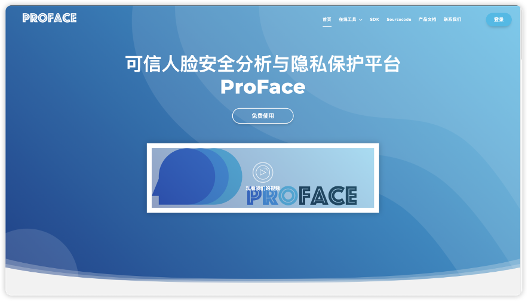

# ProFace
ProFace: A trustworthy facial data protection research platform developed by Chongqing University of Posts and Telecommunications (CQUPT). It provides efficient implementations of versatile methods for facial data security analysis and privacy protection developed by CQUPT.

This project consists of several modules: 
- **🔒 FacePrivacy:** methods for protecting facial privacy in multiple scenarios.
- **🛡️ FaceSecurity:** methods for facial data analysis (e.g., DeepFake detection, forensic analysis).
- **🌐 WebPortal:** A versitile portal for multimedia security analysis and privacy protection.

## FacePrivacy

This [module](https://github.com/lixionga/ProFace/tree/main/FacePrivacy) implements various algorithms for facial privacy protection.
### Paper List:
**`2025.05`**: `iFADIT: Invertible Face Anonymization via Disentangled Identity Transform` **Pattern Recognition**.
[[paper](https://www.sciencedirect.com/science/article/abs/pii/S0031320325004674)][[code](https://github.com/lixionga/ProFace/tree/main/FacePrivacy/iFADIT)]

**`2025.02`**: `基于妆容风格补丁激活的对抗性人脸隐私保护` **《计算机科学》2025**.
[[paper](https://www.jsjkx.com/CN/10.11896/jsjkx.241200001)][[code](https://github.com/lixionga/ProFace/tree/main/FacePrivacy/Makeup-privacy)]

**`2024.04`**: `PRO-Face C: Privacy-Preserving Recognition of Obfuscated Face via Feature Compensation` **IEEE TIFS 2024**.
[[paper](https://ieeexplore.ieee.org/document/10499238)][[code](https://github.com/lixionga/ProFace/tree/main/FacePrivacy/PRO-Face%20C)]

**`2023.11`**: `Invertible Image Obfuscation for Facial Privacy Protection via Secure Flow` **IEEE TCSVT 2023**.
[[paper](https://ieeexplore.ieee.org/document/10366303/)][[code](https://github.com/lixionga/ProFace/tree/main/FacePrivacy/PRO-Face%20S)]

**`2022.10`**: `PRO-Face: A Generic Framework for Privacy-preserving Recognizable Obfuscation of Face Images` **ACM Multimedia 2022**.
[[paper](https://dl.acm.org/doi/10.1145/3503161.3548202)][[code](https://github.com/lixionga/ProFace/tree/main/FacePrivacy/PRO-Face)]

## FaceSecurity

This [module](https://github.com/lixionga/ProFace/tree/main/FaceSecurity)  implements various algorithms for facial data analysis.
### Paper List:
**`2025.7`**:`Deepfake Detection Leveraging Self-Blended Artifacts Guided by Facial Embedding Discrepancy` **IEEE TCSVT 2025**.
[[paper](https://ieeexplore.ieee.org/abstract/document/11068978)][[code](https://github.com/lixionga/ProFace/tree/main/FaceSecurity/EG)]

**`2024.11`**: `Advancing Generalized Deepfake Detector with Forgery Perception Guidance` **ACM Multimedia 2024**.
[[paper](https://doi.org/10.1145/3664647.3680713)][[code](https://github.com/lixionga/ProFace/tree/main/FaceSecurity/FPG)] 

**`2024.08`**: `Inspector for Face Forgery Detection: Defending Against Adversarial Attacks From Coarse to Fine` **IEEE TIP 2024**.
[[paper](https://doi.org/10.1109/TIP.2024.3434388)][[code](https://github.com/lixionga/ProFace/tree/main/FaceSecurity/Inspector)]

## WebPortal

This [module](https://github.com/lixionga/ProFace/tree/main/Portal)  implements a trustworthy portal, with all relevant functionalities powered by the algorithms from Face Privacy and Face Security.

### Key Features:

🔒 **Face Privacy Protection**

✔ Real-time anonymization
✔ Offline anonymization 
✔ Reversible de-identification 

✔ Adversarial privacy 
✔ Privacy-preserving face recognition 

🛡️ **Deepfake & Face Security**

✔ Image-based deepfake detection 
✔ Video-based forgery detection

✔ Audio-visual deepfake detection
✔ Active/passive defense

### Preview:

